# 01 · Why context engineering — and why now

> **TL;DR.** "Prompt engineering" was the right name for what people did with LLMs in 2022–2023, when the model only saw a single user message. The work has since changed shape entirely: most of the input the model now sees is *not* the user's sentence but tools, memory, retrieved chunks, and conversation history that an engineer assembled. **Context engineering** is the discipline of doing that assembly well across all six layers, so that the model has the right information, in the right place, at the right cost. This first post explains why the rename happened, what is and is not new, and what you will be able to do by the end of the series.
>
> **Reading time:** ~12 minutes.
>
> **After reading this you will be able to:**
> - State, in one sentence, what separates context engineering from prompt engineering.
> - Recognise the five recurring jobs of a context engineer in any LLM project.
> - Decide whether a given problem is a prompt problem, a context problem, or a model problem.

---

## 1. The thing the name used to describe is gone

In December 2022, "prompt engineering" was a perfectly accurate description of the work. You opened a chat box. You typed one message. The model read that message and produced an answer. If the answer was bad, you re-worded the message. The entire surface area of the practice fit into a single text box.

Three things happened between that December and 2025 that broke the name.

**First, models gained tools.** Function calling shipped in mid-2023; by 2024 every major provider supported it natively; by 2025 the Model Context Protocol made tool definitions portable across hosts. The model now sees, on every call, the JSON schema of every tool it might use — sometimes thousands of tokens before the user's message even appears.

**Second, models gained access to outside data.** Retrieval-Augmented Generation (RAG) became the default pattern for any production system. The user asks a one-line question; the system retrieves five or ten relevant chunks from a vector database; those chunks are concatenated into the prompt. By the time the model reads the user's words, it has already read several pages of evidence the user never typed.

**Third, models gained memory.** The conversation buffer is the obvious form, but persistent memory — episodic recalls of past sessions, semantic facts in `CLAUDE.md`, procedural skills in `.skills/` — is now standard in serious agent systems. None of this is the user's prompt; all of it shapes the answer.

Add the system prompt and the conversation history that already existed, and the picture is unmistakable. The user's literal sentence is a small fraction of what the model reads. A modern call is not a prompt being engineered; it is a **window** being assembled.

That is what the rename is acknowledging. The old name described a slice. The new name describes the whole.

---

## 2. Who said what, and when

The phrase **"context engineering"** had been circulating in agent-builder circles for at least a year before it stuck. Several people pushed it into the mainstream within a few weeks of each other in mid-2025.

**Andrej Karpathy** popularised the term on social media in June 2025 and gave the canonical short definition:

> *"+1 for 'context engineering' over 'prompt engineering'. People associate prompts with short task descriptions you'd give an LLM... In every industrial-strength LLM app, context engineering is the delicate art and science of filling the context window with just the right information for the next step."*

**Anthropic** published "Effective context engineering for AI agents" in September 2025, framing it as a superset of prompt engineering and treating context as a finite resource subject to a token budget.

**IBM** published "What is context engineering?" on Think the same month, defining it as "the discipline of designing and managing the entire information payload provided to an LLM at inference time".

**Lance Martin** wrote the influential "Context Engineering for Agents" essay, which named the four primitives — **Write, Select, Compress, Isolate** — that this series uses throughout.

**Dex Horthy's** "12-Factor Agents" project, drawn from interviews with practitioners, made the practical case that nearly every production-grade agent failure traced back to a context decision rather than a model limitation.

The exact phrasing varies; the substance does not. All of them are pointing at the same shift: the work is no longer about the sentence you send to the model.

---

## 3. What is genuinely new, and what is not

It is fair to ask whether the rename is hype. Most of the techniques *are* old. Few-shot prompting, system prompts, retrieval, summarisation — none of these are 2025 inventions. So what changed?

Two things changed, and they are large.

**The interface is no longer a single string.** A modern API call is a structured object with a system field, a tools field, and a list of messages, often containing retrieved attachments and cache markers. Engineering this object is qualitatively different from engineering a sentence. The unit of work is not a phrase; it is a layered data structure.

**The window is finite, and the cost is real.** A 200 000-token context window sounds infinite until you fill it. At Claude Sonnet 4.5 input rates, a single 100 000-token uncached call costs about three US dollars; multiply by ten thousand daily users and the answer becomes interesting. Engineering decisions — what to include, what to compress, what to write to disk — now translate directly into latency and money.

In short: prompt engineering was a craft. Context engineering is the same craft, applied to a different surface, under hard budget constraints.

---

## 4. The five jobs of a context engineer

Whatever the application — coding agent, customer-support bot, research assistant — the day-to-day work decomposes into the same five jobs.

**1. Decide what goes in.** Which layers do you populate? Which tools do you expose? Which memories do you replay? Which documents do you retrieve? This is the most visible decision and usually where teams start.

**2. Decide what stays out.** The harder, more important sibling of the first job. Every token that does not need to be there competes for the model's attention with the tokens that do. Pruning is not optimisation; it is correctness work. (Posts 05 and 10.)

**3. Decide where each piece sits.** Position matters. The model attends more strongly to the start and end of the window than to the middle (Liu et al., 2023). Cacheable layers must come first or they cannot be cached. The user's instruction usually belongs last, on purpose. (Post 03.)

**4. Decide when to refresh, compress, or write out.** A long-running session accumulates context; left alone, it rots. Engineers schedule compaction, summarisation, and externalisation of state to disk. (Post 10, Post 14.)

**5. Decide how to measure whether it worked.** Without traces, evals, and cost dashboards, every change is a guess. The same change that improves answers on one slice of traffic can silently degrade another. (Post 17.)

If you find yourself doing one of these five jobs, you are doing context engineering, regardless of what is on your job title.

---

## 5. When is a problem *not* a context problem?

Not every LLM bug is a context bug. Before reaching for a retrieval pipeline or a memory system, it is worth ruling out two simpler possibilities.

**It might be a prompt problem.** If a single, isolated message produces a bad answer and rewording it fixes the answer, you have a prompt problem. These still exist; they just cover less ground than they used to.

**It might be a model problem.** If the right information is demonstrably in the window, in a sensible position, and the model still fails — for example, on a task requiring deeper reasoning than the model can perform — you have a model problem. The fix is a stronger model, not more context.

What is left is the large middle: cases where the model is capable in principle but is being given the wrong information, in the wrong place, or in the wrong amount. Those are context problems, and they are the subject of this series.

---

## 6. What this series will and will not cover

This series is **framework-agnostic** by design. The examples use plain Python and direct provider SDKs (Anthropic, OpenAI, Google, the MCP reference implementation). Frameworks — LangChain, LlamaIndex, CrewAI, AutoGen, LangGraph — are introduced only when they materially change the shape of a solution, and never as a protagonist. This is not a stance against frameworks; it is a commitment to teaching the underlying shapes first, so you can choose tools later with eyes open.

The series will go deep on:

- The **six layers** of every modern context window, what each is for, and how they interact.
- The **four primitives** — Write, Select, Compress, Isolate — that organise every context-engineering decision.
- **RAG**, properly: chunking, hybrid search, reranking, contextual embeddings, and where vanilla RAG breaks.
- **Memory systems**: short-term, long-term, episodic, semantic, procedural — and which of them you actually need.
- **Tools and the Model Context Protocol**, including how to design a tool that is easy to use well and hard to use badly.
- **Cost, latency, and prompt caching** — the math that makes long-context apps survivable in production.
- **Observability and evals** — how to know whether a context change made things better or worse.
- **Security** — direct and indirect prompt injection, exfiltration through tools, and the dual-LLM pattern.
- **Multi-agent systems** — when isolation pays for itself and when it just multiplies your token bill.
- Three full **build-from-scratch** walkthroughs: a coding agent, a research agent, and a support agent.

It will *not* try to be a survey of every framework, every vector database, or every paper. There are good surveys; this is a tutorial.

---

## 7. The plan from here

The next post lays out the **six layers** of a modern context window and shows them in a real API call, so the rest of the series has a concrete spine to point at. Post 03 explains how the model actually reads what you send it. Post 04 introduces the three budgets — token, cost, latency — that govern every decision. Post 05 catalogues the failure modes you will see when one of those budgets is violated.

By the end of Part I, you will have a vocabulary, a mental model, and a debugging checklist. Everything in Parts II–V is a deeper look at one piece of that picture.

---

## Common pitfalls

- **Treating "context engineering" as a synonym for "RAG".** RAG is one source for one of the six layers. It is not the whole job.
- **Confusing the context window (a hard model limit) with the context (what you actually choose to put in it).** The window is a budget; the context is your spending plan.
- **Adding more context to fix a bad answer, when the right move was to remove some.** More tokens is not more signal; very often it is less.
- **Optimising one layer in isolation.** Layers interact: a longer system prompt costs every retrieved chunk a little less attention.
- **Skipping evals because "the answers look better".** They look better on the four examples you tried. Run an eval set before you ship.

---

## Further reading

- Andrej Karpathy on context engineering — see the original tweet thread (June 2025).
- Anthropic Engineering, "Effective context engineering for AI agents" (September 2025).
- IBM Think, "What is context engineering?" (September 2025).
- Lance Martin, "Context Engineering for Agents" — the WSCI essay.
- Dex Horthy, "12-Factor Agents" — practitioner patterns from production agent failures.

Full citations are in [REFERENCES.md](../../REFERENCES.md).

---

## What to read next

- **[Post 02 — The six layers of context](../02-six-layers-of-context/index.md)** — the structural view: every modern call is a stack of six well-defined layers.
- **[Post 06 — Write, Select, Compress, Isolate](../06-write-select-compress-isolate/index.md)** — if you prefer to start with the verbs instead of the nouns.
