# 02 · The six layers of context

> **TL;DR.** Every modern LLM call is a stack of **six layers**: the system prompt, the tool and MCP descriptions, memory and state, retrieved RAG chunks, the conversation history, and the user instruction. Each layer has a distinct job, a distinct lifetime, and a distinct cost profile. The rest of this series is, in effect, a deep dive on one or two layers at a time. This post gives you the structural overview, shows the layers in a real API call, and explains why the order matters.
>
> **After reading this you will be able to:**
> - Name the six layers and say what each one is for.
> - Identify each layer in a raw Anthropic, OpenAI, or Gemini request.
> - Predict which layer is responsible for a given category of failure.


*The context window as a priority-ordered stack: stable prefix at the bottom, the current user turn on top, with the "lost in the middle" attention curve (Liu et al., 2023) overlaid on the right.*

---

## 1. What the model literally receives

Before splitting the context window into parts, it helps to see what an LLM actually gets on a single call. There is no hidden state, no database it queries behind your back, no memory of the last conversation. The model receives **one flat sequence of tokens** and produces the next token. Everything an application "knows" has to be serialised into that one sequence, every time.

That flat sequence is not shapeless, though. In any real application it is assembled from a handful of recurring parts, each written by a different piece of code, each with its own job. Naming those parts is what the rest of this post does.

---

## 2. Why "layers"?

The word *layer* is borrowed from networking and graphics for the same reason it is useful there: it lets you reason about one concern at a time.

Each layer in a context window has:

- a **purpose**: the question it answers for the model,
- a **lifetime**: how often it changes,
- a **cost shape**: how it interacts with the prompt cache,
- and a **failure mode**: the kinds of bugs it is responsible for when it goes wrong.

These four properties are different for every layer, and they are why you cannot debug an LLM application by squinting at the raw prompt. You debug it by asking, *"which layer is wrong?"*

There is nothing magical about the number six. Different authors split or merge categories slightly differently: Anthropic's blog post groups tools with the system prompt, IBM separates "instructions" from "format". The split used here is the one most useful for tutorial purposes; once you have it in your head, the regroupings will feel like cosmetic edits.

---

## 3. The six layers, briefly

The "typical size" column below is an illustrative order-of-magnitude guide, not a measured figure; real sizes vary widely by application.

| # | Layer | Purpose | Lifetime | Typical size (illustrative) |
|---|-------|---------|----------|--------------|
| 01 | **System prompt** | Identity, rules, format, knowledge the model always needs | rarely changes | 0.5–10k tokens |
| 02 | **Tools / MCP** | Schemas of every callable function | rarely changes | 1–20k tokens |
| 03 | **Memory & state** | Persistent facts about the user/session/task | changes between sessions | 0.1–5k tokens |
| 04 | **RAG / retrieved chunks** | Evidence retrieved for *this* turn | changes every turn | 1–50k tokens |
| 05 | **Conversation history** | Previous user/assistant turns of the current session | grows monotonically | 0–100k tokens |
| 06 | **User instruction** | The current turn: what the user just asked | changes every turn | 0.01–1k tokens |

Layers 01–02 are the **stable prefix**: identical on every call, ideal cache material. Layers 03–04 are the **per-turn injection**: assembled fresh, often the most expensive layer to serve. Layer 05 is the **growing tail**: the thing that runs out of room first. Layer 06 is the **trigger**: small, last, and the reason all the other layers exist.

---

## 4. Layer 01: System prompt

The system prompt is the first message the model sees. It tells the model who it is, how to behave, what format to answer in, and what knowledge to assume.

In well-run projects, the system prompt is **software**. It lives in version control. It has a changelog. It is reviewed in pull requests. The two most common conventions are `CLAUDE.md` (Anthropic's Claude Code) and `AGENTS.md` (Codex, Cursor, and others). Both are plain Markdown files that the host application loads at session start and folds into the system prompt (layer 01); the exact injection differs by host.

A system prompt typically covers four blocks:

1. **Identity**: "You are a senior backend engineer working in this monorepo."
2. **Rules**: "Never run `rm -rf` without explicit confirmation. Always run the test suite after edits."
3. **Format**: "Answer in Markdown. Use fenced code blocks. Cite file paths as `src/foo.py:42`."
4. **Knowledge**: short, stable facts: the project's stack, the team's conventions, the build command.

What does *not* belong in the system prompt: anything that changes per turn (that is layer 04 or 06), anything large (that is layer 04), and anything user-specific that varies between users of the same app (that is layer 03).

[Post 14](../14-system-prompt-as-software/index.md) goes deep on system prompts, including the `CLAUDE.md` vs `AGENTS.md` conventions.

---

## 5. Layer 02: Tools and MCP descriptions

If the model can call functions, every callable function's **JSON schema** rides in the prompt on every call. The model sees the name, the description, the parameters, and (for many providers) examples. It uses this information to decide whether to call a tool and which one.

Two practical consequences follow.

**Tool schemas are a token bill.** Consider a hypothetical example: a poorly-written tool with a 400-line description, repeated for ten tools, could occupy on the order of a few thousand tokens *per call* before the user has typed anything. Naming, descriptions, and parameter docs are not "documentation" to be lazy about; they are the prompt.

**The Model Context Protocol (MCP)** is the open standard for how a host application (Claude Desktop, Cursor, VS Code, a custom app) talks to external tool servers. An MCP server exposes three primitives: **tools** (callable functions), **resources** (readable data), and **prompts** (re-usable templates). The host pulls these in and exposes them to the LLM as layer 02.

[Post 15](../15-tools-and-mcp/index.md) covers tool design, MCP, and the eternal question of "how many tools is too many".

---

## 6. Layer 03: Memory and state

Anything that should persist beyond a single call but is not literally part of the conversation lives here. In practice this splits into:

- **Short-term memory**: working scratchpads and plan files for the current task.
- **Long-term memory**: three sub-flavours:
  - **Episodic**: past interactions ("on April 4 the user asked about webhooks"), stored as embedded events and retrieved by similarity.
  - **Semantic**: distilled facts and preferences ("user prefers Python, stack is AWS"), curated and slowly changing.
  - **Procedural**: re-usable skills and routines, often as Markdown skill files or slash commands.

Memory is replayed into the prompt as a synthetic turn or block at the start of the message list: a fabricated user/assistant exchange the application inserts, so the stored facts arrive as if they had been said in the conversation (see the code in Section 10). The model does not "remember" anything; it just reads what is put there. [Post 16](../16-memory-systems/index.md) is an entire post on this.

---

## 7. Layer 04: Retrieved chunks (RAG)

RAG (retrieval-augmented generation) is the pattern of fetching relevant text at query time and pasting it into the prompt. Layer 04 is the answer to the question, *"What evidence does the model need to answer this specific question?"*

The pipeline is the same one a million blog posts have drawn:

1. **Index**: chunk the documents, embed each chunk, store the vectors.
2. **Retrieve**: at query time, embed the user's question, find the top-k (the k best-matching) chunks by vector similarity, often combined with a BM25 pass (a classic keyword-matching relevance score), a setup called *hybrid search*.
3. **Rerank**: a cross-encoder (a model that scores the query and a chunk together, rather than comparing pre-computed vectors) re-scores the top-k and keeps the top three to five.
4. **Augment**: those chunks are concatenated into the prompt, usually as a `<context>` block before the user's question.

Each of these terms is defined properly in [Post 09](../09-select-strategies/index.md); the one-line glosses here are enough to read the diagram. What the millions of blog posts often miss is that vanilla RAG is the *floor*, not the *ceiling*. Contextual retrieval (Anthropic, 2024), agentic retrieval (the model decides what to fetch next), GraphRAG, and Self-RAG variants are now standard in serious systems. [Post 11](../11-rag-in-depth/index.md) does the deep dive; [Post 17](../17-advanced-retrieval/index.md) covers the agentic and graph variants.

---

## 8. Layer 05: Conversation history

This is the layer everyone thinks of as "the chat". It is also the layer that runs out of room first.

Three strategies are in common use:

- **Sliding window**: keep the last N turns; throw the rest away. Cheap, simple, loses everything older than N.
- **Rolling summary**: keep a summary of older turns plus the most recent verbatim turns. The Claude Code `/compact` command and most agent frameworks use a variant of this.
- **Selective recall**: embed the conversation, retrieve only turns relevant to the current question. More work, often worth it.

There is a fourth, important option: **don't keep history at all.** For a stateless task (a one-shot translation, a fresh code review), the cheapest and best behaviour is often to start fresh.

---

## 9. Layer 06: The user instruction

The thing the user typed.

Three properties matter for engineering:

1. **It is small.** Usually a sentence or two.
2. **It is placed last.** This is on purpose: the model attends most strongly to the end of the window, and the user's request is the thing that should dominate the answer.
3. **It is the only layer the user sees.** Everything else is invisible, which is why a context engineer's work feels, to users, like the model "just got better".

When users complain about an LLM app, they are almost always describing a layer 01–05 problem in the language of layer 06. Recognising which underlying layer is at fault is exactly the skill Section 12 turns into a lookup table.

---

## 10. The six layers, in a real API call

Here is what the layers look like as JSON, on the wire to the Anthropic Messages API:



*The same request annotated layer by layer: `system` is layer 01, `tools` is layer 02, and layers 03–06 are all entries in the `messages` array.*

The shape is the same on OpenAI's Chat Completions and Responses APIs, on Google's `generateContent`, and on every other major provider. The field names differ; the layers do not. The mapping for the three most common APIs:

| Layer | Anthropic Messages | OpenAI Chat/Responses | Gemini `generateContent` |
|---|---|---|---|
| 01 System prompt | `system` | `system` message in `messages` | `systemInstruction` |
| 02 Tools / MCP | `tools` | `tools` | `tools` |
| 03–05 Memory, RAG, history | entries in `messages` | entries in `messages`/`input` | entries in `contents` |
| 06 User instruction | last `user` message | last `user` message | last `user` entry in `contents` |

*The names change; the six jobs are constant. Anthropic and Gemini lift the system prompt into a dedicated top-level field, whereas OpenAI keeps it as the first entry in the message array.*

A small, provider-agnostic Python sketch that prints the assembled context for a single turn:

```python
# context_inspector.py: a 40-line agent context dumper
from typing import Any

def assemble_context(
    *,
    system_prompt: str,
    tool_schemas: list[dict[str, Any]],
    memory: list[str],
    retrieved_chunks: list[str],
    history: list[dict[str, str]],
    user_instruction: str,
) -> dict[str, Any]:
    """Return a request body in Anthropic Messages shape, layered explicitly."""
    messages: list[dict[str, str]] = []

    # Layer 03: memory injected as a synthetic exchange
    if memory:
        messages.append({"role": "user", "content": "[memory]\n" + "\n".join(memory)})
        messages.append({"role": "assistant", "content": "Acknowledged."})

    # Layer 04: retrieved chunks as a user-side evidence block
    if retrieved_chunks:
        evidence = "\n\n".join(f"<chunk>{c}</chunk>" for c in retrieved_chunks)
        messages.append({"role": "user", "content": f"[retrieved]\n{evidence}"})

    # Layer 05: prior conversation
    messages.extend(history)

    # Layer 06: the current user turn, placed last
    messages.append({"role": "user", "content": user_instruction})

    return {
        "system": system_prompt,    # Layer 01
        "tools": tool_schemas,      # Layer 02
        "messages": messages,
        "model": "claude-sonnet-4-5",  # illustrative; model ids change over time
        "max_tokens": 1024,
    }


if __name__ == "__main__":
    import json
    body = assemble_context(
        system_prompt="You are a helpful research assistant.",
        tool_schemas=[{"name": "search_docs", "description": "...", "input_schema": {}}],
        memory=["User prefers concise answers in Python."],
        retrieved_chunks=["Webhooks are HTTP callbacks fired on events..."],
        history=[
            {"role": "user", "content": "How do webhooks work?"},
            {"role": "assistant", "content": "A webhook is..."},
        ],
        user_instruction="Now show me how to rotate the signing secret.",
    )
    print(json.dumps(body, indent=2))
```

Running this once against a real agent is worth the trouble: a surprising number of "model bugs" are visibly a layer-03 or layer-04 bug as soon as the assembled body is on screen.

---

## 11. Why the order matters

Three reasons the order in the table is not arbitrary.

**Caching.** Most providers' prompt caches require a byte-identical *prefix*. Layers 01–02 are stable across calls; if they sit at the front, they cache. Slipping per-turn content above them breaks the cache, and the cost jumps sharply, since an Anthropic cache read costs roughly 10% of the base input price (Anthropic, 2024–25) and a cache miss pays the full rate. [Post 25](../25-long-context-vs-rag/index.md) walks the cost math.

**Attention.** The empirical "lost in the middle" finding (Liu et al., 2023) shows that LLMs attend more strongly to the start and end of long contexts than to the middle. The user's question, the thing the model should focus on, belongs at the end. Background facts that the model should "have read" but not "be thinking about" can sit in the middle.

**Failure isolation.** A predictable layering makes debugging linear. If the system prompt is always at index 0 and the user instruction is always last, a misbehaving agent can be diagnosed by inspecting exactly one layer at a time, rather than scanning a 50,000-token wall of text.

---

## 12. A pragmatic mental model

The whole point of the six-layer split is diagnostic. When an application misbehaves, the symptom the user reports almost always points at a specific layer. The table below maps common complaints to the layer to inspect first. It is a starting heuristic, not a law: some bugs span layers, and the pointers name the post where each is treated in depth.

| Symptom the user reports | Most likely layer | Look at | Treated in |
|---|---|---|---|
| "It ignored an instruction it followed yesterday." | 01 System prompt | A rule got edited, truncated, or buried mid-prompt | [Post 14](../14-system-prompt-as-software/index.md) |
| "It calls the wrong tool / invents parameters." | 02 Tools / MCP | Vague names or descriptions; too many tools competing | [Post 15](../15-tools-and-mcp/index.md) |
| "It forgot a preference I set earlier." | 03 Memory & state | Nothing was persisted, or memory was not replayed | [Post 16](../16-memory-systems/index.md) |
| "The answer is confidently wrong on a fact in our docs." | 04 RAG | The right chunk was never retrieved, or was reranked out | [Post 11](../11-rag-in-depth/index.md) |
| "It loses the thread in long chats." | 05 History | Window overflow, or the key turn fell out of the summary | [Post 08](../08-write-strategies/index.md) |
| "It answers a different question than I asked." | 06 User instruction | The request is buried above other content, not placed last | [Post 06](../06-context-failure-modes/index.md) |

Keep the layers in mind as a checklist. Faced with any context bug, walk them top to bottom and ask *"is this layer carrying what it should, and nothing it should not?"* Nine times out of ten, the wrong layer is obvious once the layers are named. The failure modes themselves (distraction, confusion, conflict, lost-in-the-middle, tool-storm) get their own systematic treatment in [Post 06](../06-context-failure-modes/index.md).

---

## Common pitfalls

- **Stuffing per-turn data into the system prompt.** Tempting (it feels "important") and ruinous for caching. Use layer 03 or 04.
- **Letting tool schemas grow unbounded.** Every added tool costs every call. As a rule of thumb, if a tool is not worth 200 tokens of attention on every turn (an illustrative threshold), it should not be a tool.
- **Mixing memory and retrieval.** They look similar but answer different questions. Memory is "what persists that is known?"; retrieval is "what is needed *for this turn*?". Conflating them blows up both layers.
- **Treating history as free.** It is not. After a few hundred turns, layer 05 is the largest line on the bill.
- **Debugging the wall of text instead of the layer.** Faced with a bad answer, resist reading the whole prompt top to bottom. Name the symptom, map it to a layer (Section 12), and inspect that layer alone.

---

## Further reading

- Anthropic Engineering, *"Effective context engineering for AI agents"* (2025): the layered view.
- Anthropic, *"Prompt caching"* (2024–25): why prefix order matters and the cache-read discount.
- Anthropic, *"Introducing Contextual Retrieval"* (September 2024): the contextual-chunking result cited in Section 7.
- IBM Think, *"What is context engineering?"* (2025): alternative breakdown of the same ideas.
- Liu, N. F. *et al.*, *"Lost in the Middle: How Language Models Use Long Contexts"* (2023).
- OpenAI, *"Function calling"* and the Chat Completions / Responses API reference: the OpenAI field names in Section 10.
- Google, *"Gemini API: `generateContent`"* documentation: the Gemini field names in Section 10.

Full citations in [REFERENCES.md](../../REFERENCES.md).

---

## What to read next

- **[Post 03 — How LLMs actually read context](../03-how-llms-read-context/index.md)**: the mechanics behind why the *order* of these layers matters.
- **[Post 04 — Tokens, windows, and budgets](../04-tokens-windows-budgets/index.md)**: the math that turns "fits in the window" into "fits in the budget".
- **[Post 14 — The system prompt as software](../14-system-prompt-as-software/index.md)**: go deep on layer 01 first when building an agent.
- **[Post 01 — Why context engineering](../01-why-context-engineering/index.md)** (back): the motivation for treating the window as an engineered artefact, if you skipped it.
