# 06 · Write, select, compress, isolate

> **TL;DR.** Once you can name the six layers of context ([Post 02](../02-six-layers-of-context/index.md)) and the five ways context fails ([Post 05](../05-context-failure-modes/index.md)), the next thing you need is a vocabulary for what you can *do about it*. The **WSCI framework** — Write, Select, Compress, Isolate — is the smallest set of primitive operations that covers every context-engineering technique in this series. The remaining posts of Part II spend one chapter on each. This post is the map.
>
> **Reading time:** ~10 minutes.
>
> **After reading this you will be able to:**
> - Name the four operations and the question each one answers.
> - Pick the right operation for any of the five failure modes.
> - Read the rest of the series knowing where each technique fits.

---

## 1. Why a framework

The honest reason: without one, every conversation about an LLM bug becomes a list of techniques with no shared structure. RAG, summarisation, sub-agents, prompt caching, semantic memory — these are all useful, but they are answers, not questions. WSCI gives you the questions.

The framework is two axes, four quadrants, four primitive verbs.

- **Direction** — does the operation move information *into* the context or *out of* it?
- **Scope** — does the operation act on a *single* context window or *split* the work across several?

| | Single window | Multiple windows |
|---|---|---|
| **Information in** | **Select** — pull the right facts in for *this* turn | (Implicit: each isolated agent runs its own select) |
| **Information out** | **Compress** — shrink what is already inside | **Write** — move information out so it can be retrieved later |
| **Boundary** | **Isolate** — split the work itself into separate contexts | |

The framing is the one popularised by the LangChain team in 2024–25 ("Context Engineering for Agents") and adopted by Anthropic, IBM and others with cosmetic relabellings. It is small enough to memorise and complete enough to classify almost any technique.

---

## 2. Write — move information out for later

**The question it answers:** "What should I keep around even though I cannot afford to keep it in this prompt?"

Write is the operation that puts information *somewhere other than the live context window*. The destination is some kind of persistent store: a file, a database row, a vector index, a memory store, an `AGENTS.md`, a scratchpad, a ticket. The defining property is that the information is no longer being paid for on every API call but it is still recoverable later.

Concretely, "write" covers:

- **Persistent memory** — episodic facts, semantic preferences, procedural rules ([Post 14](../14-memory-systems/index.md)).
- **Scratchpads** — a sub-agent's intermediate work, dropped to disk between iterations.
- **Repository documentation** — `AGENTS.md`, `CLAUDE.md`, `skill.md` files that load conditionally.
- **Audit logs** — full conversation transcripts kept for debugging and evals, *not* in the prompt.
- **Embeddings** — the offline write side of RAG: documents are chunked, embedded, and indexed *before* they are needed.

Write is the cheapest of the four operations to perform and the one that pays the largest long-term dividends. The cost is a small extra hop (one API call to summarise, one database insert) at the moment of writing; the benefit is one fewer thing competing for context space on every subsequent call.

The most common Write mistake is to write everything indiscriminately. A memory store with no provenance, no decay, and no schema becomes a poisoning factory ([Post 05](../05-context-failure-modes/index.md), §2). Write is also the only operation that has a meaningful security surface — anything you write becomes data the agent will trust on the next read. Post 18 is dedicated to this side of the trade-off.

[Post 07](../07-write-strategies/index.md) is the deep dive.

---

## 3. Select — pull the right information in for *this* turn

**The question it answers:** "Of everything I could have included, what does the model actually need *right now*?"

Select is the operation that decides what enters the per-turn payload. The classic instance is **retrieval-augmented generation (RAG)**: a corpus of millions of tokens lives offline, a query at inference time fetches the handful of chunks most relevant to the current turn, and only those chunks land in the prompt. But RAG is one species of Select; there are others.

- **Tool selection** — the agent has a hundred tools but only the schemas of the few relevant to this turn are exposed. The dynamic version of this is the central insight of the MCP ecosystem ([Post 13](../13-tools-and-mcp/index.md)).
- **Memory retrieval** — pulling a few episodic facts from a vector store of years of session history.
- **Few-shot example selection** — choosing the two or three most similar prior examples to seed in-context learning, instead of a static set.
- **Conversation-history selection** — including the last *k* turns plus a topic-relevant turn from earlier in the session.

Two design tensions sit at the heart of every Select: **recall vs. precision** (do I get the right chunk? do I get *only* the right chunk?) and **breadth vs. depth** (do I get a wide range of plausible matches, or a small number of high-confidence ones?). The post on RAG ([Post 09](../09-rag-in-depth/index.md)) and the post on advanced retrieval ([Post 15](../15-advanced-retrieval/index.md)) take both apart in detail.

Select is the operation that most rewards engineering effort. Going from "embed and top-k" to "hybrid search + rerank" is often a 2–3× quality jump on the same data, with no model change.

[Post 08](../08-select-strategies/index.md) is the deep dive.

---

## 4. Compress — shrink what is already inside

**The question it answers:** "I cannot drop this information, but I cannot afford to keep it verbatim. What is the smallest representation that still works?"

Compress acts on tokens that are *already* in the context. It does not change *what* is in the prompt; it changes *how much* of it. Five techniques cover essentially every production system:

1. **Windowing** — keep the last *N* turns; drop the rest. Cheap, lossy in a known way.
2. **Summarisation** — replace a span of context with an LLM-generated summary. Costs an extra call; preserves semantics.
3. **Tool-result clearing** — drop the body of a tool response after extracting the bits the agent needed. Safe (deterministic; re-callable) and underused.
4. **Priority pruning** — assign each layer a priority class (P0 system prompt, P1 recent, P2 older history, P3 stale tool results) and trim from the lowest first. Rule-based and cheap.
5. **Semantic chunking** — group context by topic, summarise each topic independently. Highest quality, highest cost.

The number to keep in mind is the **information retention ratio** (IRR): the fraction of key facts that survive a compression pass. A useful target is *80–90 % IRR* at *70–90 %* token reduction. More aggressive compression is possible but tends to lose nuance ("what was decided" without "why"). [Post 10](../10-compress-strategies/index.md) walks through each technique with numbers.

Almost every long-running agent reaches a point where compression is no longer optional. Auto-compaction triggers in Claude Code (around 80 % of the window) and in agent frameworks generally are an attempt to make this automatic — but the policy still has to be designed, because the framework cannot know which 90 % of your context is the safe-to-summarise 90 %.

---

## 5. Isolate — split the work into separate contexts

**The question it answers:** "Can I do this task in pieces, each with its own clean context, instead of one monster prompt?"

Isolate is the operation that gives up on a single context window and uses several. The two most common instances:

- **Sub-agents.** A research task is decomposed into "find sources", "read each source", "synthesise". Each sub-task runs in its own context window, with its own scoped tools and its own scoped memory. The orchestrator sees only the *result* of each sub-task, not the full transcript ([Post 11](../11-isolate-strategies/index.md)).
- **Sandboxing.** Tool execution happens in a process whose stdout is not all funnelled back into the model's context. Only the structured result returns; the noisy `npm install` log stays out.

Isolate is the most powerful operation on this list and the most often misused. Done right, an isolated sub-agent has *no chance* of suffering distraction or drift from the parent's context, because that context is not in its window. Done wrong, sub-agents become a way to multiply your token bill by *N* while introducing coordination bugs the single-agent version did not have.

The single rule worth memorising: **isolate when the sub-task has a clean input contract and a clean output contract.** "Find me the three most relevant papers and return their titles and DOIs" is a perfect sub-agent. "Help me think through the problem" is a terrible one — there is no clean output that the orchestrator can integrate.

---

## 6. WSCI vs. the five failure modes

The reason WSCI is worth memorising is that the four operations map cleanly onto the five failure modes in Post 05.

| Failure | First-line operation | Second line |
|---|---|---|
| Poisoning | **Write** (vet at write time, decay) | Isolate (a sub-agent does the validation) |
| Distraction | **Compress** (shrink history) | Select (re-rank retrieval) |
| Confusion | **Select** (fewer, more distinct tools) | Isolate (one sub-agent per tool family) |
| Clash | **Compress** (de-duplicate) + Write (one canonical rule) | — |
| Drift | **Compress** (summarise on schedule) | Isolate (sub-agents reset their own context) |

Read it the other way and a useful rule emerges: **most of the time, the right operation is Compress.** Most production prompts are too long, in part because the cost of *not* compressing was invisible during development. Compress is also the operation that makes Select cheaper (smaller prompts let you afford more retrieval) and Isolate possible (clean summaries are clean inputs for sub-agents). Hence the order in which Part II covers them: Write first (the foundation), Select second (the input pipeline), Compress third (the day-to-day discipline), Isolate fourth (the structural lever).

---

## 7. A worked walk-through

A concrete example to anchor the four operations. Imagine a customer-support agent that has been running for three months.

- **At setup**, you **Write** the company's product knowledge into a vector index, write a `CLAUDE.md` with tone and policy rules, and write per-customer profiles into a key-value store.
- **On every turn**, you **Select**: the top-5 RAG chunks for this question, the customer's profile, the schemas of the four tools relevant to this intent, the last three turns of the session.
- **Every twenty turns** the conversation history threatens to break the budget, so you **Compress**: a sub-agent summarises turns 1–17 into a 200-token brief; turns 18–20 stay verbatim.
- **When the customer says "build me a refund report",** the orchestrator **Isolates**: a sub-agent with database tools and no other context generates the report, returns a 1 KB result, and disappears. The main agent's context grows by one short message, not by a full report-generation transcript.

Every modern agent does some version of these four moves; the engineering is in the policies that decide *when*. The next four posts cover those policies.

---

## Common pitfalls

- **Reaching for Select when the bug is Compress.** Adding more retrieval to a system that is already over-stuffed makes things worse.
- **Treating Isolate as the default.** Sub-agents are powerful but not free. A single-agent design that fits comfortably in a 32 k prompt usually beats a three-agent design that fits in 12 k each.
- **Writing without a schema.** A memory store with no fields, timestamps, or provenance is a poisoning incident waiting to happen.
- **Compressing and then never measuring IRR.** A "summary" that drops the one fact the next turn needed is not a summary; it is a regression.
- **Conflating Select and Compress.** They feel similar (both shrink the prompt) but they are different operations: Select chooses what to *include*; Compress shrinks what is *already there*.

---

## Further reading

- LangChain Blog, *"Context engineering for agents"* (2025) — the WSCI framing.
- Anthropic Engineering, *"Effective context engineering for AI agents"* (2025) — same operations, different vocabulary.
- IBM Think, *"What is context engineering?"* (2025) — third independent re-derivation, useful for triangulation.
- Karpathy, A., *"On the term 'context engineering'"* (2024) — the Twitter thread that named the field.

Full citations in [REFERENCES.md](../../REFERENCES.md).

---

## What to read next

- **[Post 07 — Write strategies](../07-write-strategies/index.md)** — memory stores, scratchpads, AGENTS.md.
- **[Post 08 — Select strategies](../08-select-strategies/index.md)** — retrieval, tool selection, few-shot selection.
- **[Post 10 — Compress strategies](../10-compress-strategies/index.md)** — the five techniques, with numbers.
- **[Post 11 — Isolate strategies](../11-isolate-strategies/index.md)** — sub-agents, sandboxing, when to split.
