# 10 · Data ingestion and document pipelines

> **TL;DR.** Retrieval quality is decided upstream, in parsing, long before any embedding model runs. The Select posts and the RAG build assume clean plain text, but real corpora arrive as PDFs, scanned images, HTML, slides, and spreadsheets, and how you extract layout, tables, and text determines which tokens ever reach the context in the first place. This post is the missing upstream half of the Select primitive: the ingestion pipeline that turns messy source files into the clean, chunk-ready, provenance-tagged text that [Post 11](../11-rag-in-depth/index.md) then indexes.
>
> **After reading this you will be able to:**
> - Choose the right parsing strategy (born-digital extraction, layout-aware parsing, or OCR) for a given source type.
> - Preserve tables, structure, and provenance through the pipeline instead of flattening them into unusable text.
> - Stand up incremental re-indexing so a corpus that changes daily does not silently rot.


*Retrieval quality is decided upstream: what the parser keeps or drops is what the model can ever retrieve.*

---

## 1. The motivation: garbage in

A RAG system is only ever as good as the text it retrieves, and that text is only ever as good as the parser that produced it. The whole of [Post 09](../09-select-strategies/index.md) and [Post 11](../11-rag-in-depth/index.md) assumes clean plain text: paragraphs that read in order, tables that survived as tables, no navigation menus or page furniture bleeding into the content. Real corpora look nothing like that. They are PDFs exported from a design tool, decades-old scans, HTML dumps thick with cookie banners, PowerPoint decks, and spreadsheets where the meaning lives in the cell grid.

The trouble is that ingestion is invisible until retrieval quality is bad. A demo built on three tidy Markdown files retrieves beautifully, ships, and then meets a real document store, where the "chunk" that got embedded is half a table caption glued to a page-footer copyright line, with the actual answer three columns away in a cell the parser dropped. Nothing in the retrieval stack is broken: the embedding model, the reranker, and the vector database are all fine. The tokens carrying the answer never entered the index, and recall@N cannot recover a fact that was destroyed at parse time.

This inverts where teams spend their attention. Debugging effort flows to the parts that are easy to instrument (retrieval scores, prompt templates) and away from the pile of one-off parsing scripts nobody wants to own. Yet a large share of production RAG failures trace back to ingestion rather than retrieval (illustrative: the exact split depends on your corpus and is not a measured constant). The rule of thumb worth internalising: **before you tune retrieval, read the extracted text your parser actually produced.** Often the bug is visible in the first paragraph.

---

## 2. The shape of an ingestion pipeline

Every ingestion pipeline, whatever the source, has the same six stages:

```
source  →  parse  →  clean  →  enrich  →  chunk  →  index
  |          |         |         |          |         |
 raw     structured  strip    metadata,  split into  embed +
 files     text +    boiler-  provenance  units      store
           layout    plate                (Post 11)
```

*The ingestion pipeline: five upstream stages that decide what text exists at all, then chunking and indexing (the subject of Post 11) that decide how it is retrieved.*

- **Source**: fetch the raw bytes and record where they came from. A PDF from a document management system, an HTML page from a crawl, a row exported from a wiki.
- **Parse**: turn bytes into structured text, ideally preserving reading order, headings, and tables. This is the stage that makes or breaks everything downstream, and most of this post lives here.
- **Clean**: strip what is not content, boilerplate, repeated headers and footers, navigation, advertisements, and normalise whitespace and encoding.
- **Enrich**: attach metadata, source URL or path, page number, section heading, timestamp, document type, so the text carries its own provenance into the index (§7).
- **Chunk**: split the cleaned, enriched text into the units retrieval returns.
- **Index**: embed each chunk and write it to the vector and sparse indexes.

The last two stages, chunking and indexing, are the entire subject of [Post 11](../11-rag-in-depth/index.md), and this post hands off to it cleanly. Chunk size, overlap, splitter choice, contextual retrieval, the sparse index: all of that is Post 11's territory and is not repeated here. The point of separating the stages is that a failure in one is diagnosable independently of the others. If the extracted text is wrong, no chunking strategy can fix it, so the stages must be inspected in order, source first.

---

## 3. Parsing PDFs: three strategies, three situations

PDF is not one format; it is at least three, and each needs a different extractor. Choosing wrong is the most common ingestion mistake.

**Born-digital text extraction.** A PDF exported from a word processor or a web page carries its text as actual character data with positions. A library that reads the text layer directly (`pdfplumber`, `PyMuPDF`, `pdfminer.six`) pulls it out quickly and cheaply, no model required. This is the right tool for most business documents and should always be tried first because it is close to free. Its weakness: it reads glyphs by position, so a two-column layout can interleave into nonsense unless the extractor reconstructs reading order.

**Layout-aware extraction.** When reading order matters, in multi-column papers, forms, and invoices, a layout model is needed. These parsers detect regions (title, paragraph, table, figure, caption) and emit text in human reading order with structure preserved. They are heavier (many run a vision or detection model) but they turn a scrambled two-column extraction into clean, ordered Markdown. This is the class of tool §6 discusses.

**OCR for scans.** A scanned document is an *image* of text; there is no text layer to extract. Optical character recognition (OCR, recognising characters from pixels) is the only option. Tesseract (Smith, 2007) is the long-standing open-weight engine; cloud OCR services and modern vision-language models are the higher-accuracy, higher-cost alternatives. OCR introduces its own error class ("rn" read as "m", a dropped decimal point), so measure character-level accuracy on a sample before trusting a scanned corpus.

The decision procedure is simple and worth hard-coding: **try born-digital extraction; if the text layer is empty or the page is an image, fall back to OCR; if reading order or tables are mangled, escalate to a layout-aware parser.** A single corpus often needs all three, because it contains all three kinds of PDF.

---

## 4. Tables and structure: the hardest case

Tables are where naive extraction fails most destructively, and where the failure is easiest to miss because the output still *looks* like text.

Consider a pricing table. To a human it is a grid: rows are products, columns are tiers, and a cell's meaning comes from its row and column headers. A born-digital text extractor that reads glyphs left-to-right, top-to-bottom flattens that grid into a stream: `Product A Basic $10 Pro $20 Product B Basic $15 Pro $30`. The two-dimensional relationship that carried all the meaning, *which price belongs to which product and tier*, is gone. When a user later asks "what is the Pro price for Product B?", the retrieved chunk contains all four numbers and no reliable way for the model to bind `$30` to the right cell. The answer is often confidently wrong.

The fix is to preserve the grid. A table-aware parser emits the table as **Markdown or HTML**, keeping rows, columns, and headers intact:

```
| Product   | Basic | Pro  |
|-----------|-------|------|
| Product A | $10   | $20  |
| Product B | $15   | $30  |
```

Now the row-and-column structure is explicit in the token stream, and a model reading the chunk can bind `$30` to *Product B / Pro* because the header row and the leftmost column are right there. HTML is the better target when cells span multiple rows or columns (invoices and financial statements are full of these), because `rowspan` and `colspan` have no clean Markdown equivalent.

Getting there requires a parser that detects table *regions* and reconstructs cell boundaries, which is what modern layout models (table-transformer-style detectors, and the document parsers in §6) are built to do. The guidance is unambiguous: **if your corpus contains tables that carry answers, table fidelity is not optional, and it is the single parsing capability most worth paying for.** Verify it by reading the extracted table and checking a cell against the source.

Spreadsheets are the adjacent case. A well-formed sheet is already a grid, so serialise it faithfully (one row per record, headers preserved) rather than dumping cell values as prose, and keep sheet and column names as metadata so a filter can scope retrieval to the right sheet.

---

## 5. HTML and boilerplate

HTML is deceptively easy to extract and deceptively hard to extract *well*. Stripping the tags is trivial; the problem is that a web page is mostly not content. Navigation bars, footers, cookie banners, related-article rails, share buttons, and advertisements can outweigh the article by an order of magnitude, and every one of those tokens, once embedded, is a chance for retrieval to match on furniture instead of substance.

The task is **main-content extraction**: isolate the article and discard the chrome. This is a well-studied problem with mature open tools. Mozilla's Readability (the engine behind Firefox Reader View) and `trafilatura` (Barbaresi, 2021) both score DOM nodes by text density and structural cues to find the main article and drop the rest. `trafilatura` in particular is built for corpus-scale web extraction and reports strong main-content accuracy in its evaluation (Barbaresi, 2021).

Two boilerplate patterns deserve specific attention because they survive naive cleaning:

- **Repeated headers and footers.** In a PDF, the running header and the page-number footer repeat on every page. Concatenate the pages and every chunk near a page boundary is contaminated with `Confidential — Page 14 of 210`. Detect lines that recur at the same position across many pages and drop them.
- **Duplicated navigation across a crawl.** Every page in a documentation site shares the same sidebar. Embed it once per page and the index fills with hundreds of identical navigation chunks that outrank real content on any query mentioning a section name. Deduplicate near-identical blocks across documents at clean time.

The test for this stage is the same as everywhere else: read a sample of cleaned documents. If you see a cookie banner or a `Page 14 of 210` in the text destined for the index, the cleaner is not done.

---

## 6. Layout-aware tools as a class

Born-digital extraction, OCR fallback, table reconstruction, reading-order recovery, and boilerplate removal are a lot to assemble from primitives. A class of document parsers now packages most of it behind one call. Framework-agnostic examples, treated as a category rather than a recommendation, include **Docling** (IBM, open-weight), **Unstructured**, and **LlamaParse**. Each takes a PDF, DOCX, PPTX, HTML, or image and returns structured, reading-ordered output (usually Markdown or a JSON element tree) with tables preserved and, where needed, OCR applied. Consult each project's own documentation for current capabilities and limits, since this space moves quickly.

Reaching for one of these is a genuine **build-versus-buy** decision:

- **Buy (adopt a document parser)** when your corpus is heterogeneous (mixed PDFs, scans, decks, tables) and you would otherwise maintain a pile of format-specific scripts. The parser absorbs the long tail of format quirks, which is precisely the work that never ends.
- **Build (assemble from primitives)** when your corpus is narrow and stable, a single vendor's born-digital PDFs, say, where `pdfplumber` plus a table pass does the whole job at a fraction of the cost, and every dependency you avoid is one you never have to debug.

The trap on both sides is treating the tool as a black box. A document parser still errs on hard tables and unusual layouts, so the verification discipline does not change: sample the output, check tables against the source, and measure extraction quality on a held-out set before trusting a parser on a corpus you cannot eyeball. The tool changes how much you build, not whether you check.

---

## 7. Metadata and provenance at ingest

Provenance is captured at ingest or it is lost forever. Once a document has been parsed, cleaned, chunked, and embedded, there is no way to reconstruct *which page* a chunk came from unless that fact was attached on the way through. So the enrich stage writes, onto every chunk, at least: **source** (path or URL), **page** (or slide, or sheet), **section** (the nearest heading), **timestamp** (when the source was last modified), and **document type**. This costs almost nothing and is impossible to backfill.

It pays off in three places downstream:

- **Citations.** [Post 11](../11-rag-in-depth/index.md) shows the model quoting a chunk's header back as a citation the application renders. That header is exactly the provenance captured here. No provenance at ingest, no citation at generation, no way for a user to verify an answer.
- **Conflict resolution.** When two chunks disagree, an old policy and its replacement, the timestamp and source metadata let the system prefer the newer or more authoritative one. Conflict is one of the five failure modes catalogued in [Post 06](../06-context-failure-modes/index.md), and dated provenance is a large part of the cure: a model told "prefer the source with the most recent timestamp" can resolve a contradiction that would otherwise produce a confidently stale answer.
- **Filtered retrieval.** Metadata filtering ([Post 09](../09-select-strategies/index.md), §3) is only possible if the metadata exists. Scoping a query to one document, one date range, or one language is free recall, but only if `source`, `timestamp`, and `language` rode along from ingest.

A useful discipline is a **manifest table**, one row per source document recording its hash, its chunk ids, the parser and embedding-model versions, and the ingest timestamp. Post 11 introduces the same table from the indexing side; build it once and share it, because it is the record that answers "what changed, and what parsed it".

---

## 8. Incremental re-indexing and change detection

A corpus is not a snapshot; it is a stream. Documents are added, revised, and retired, and an index that was correct at launch drifts out of date unless it tracks those changes. Re-parsing and re-embedding the whole corpus on every change works for a thousand documents and is ruinous at a million, so real pipelines re-index *incrementally*.

The mechanism is **content hashing**. For each source document, store a hash of its bytes (or of its extracted text) in the manifest. On each ingest run, three cases fall out:

- **Unchanged** (hash matches the stored hash): skip it. This is the overwhelming majority on a typical run and is why incremental indexing is cheap.
- **Changed** (hash differs): re-parse, re-chunk, re-embed, and *replace* the document's old chunks. Replacement is the step teams forget, and forgetting it is the "embedding stale chunks" failure from [Post 11](../11-rag-in-depth/index.md): the new chunks land but the old ones linger, so the agent retrieves and confidently cites a policy that was superseded months ago.
- **Deleted** (in the manifest, absent from the source): remove its chunks from both indexes.

Content hashing also gives near-free **deduplication**: two source documents with the same hash are the same document, and only one copy needs indexing. The whole scheme depends on the manifest from §7, which is why provenance and incremental re-indexing are really one design: the metadata you capture at ingest is the same metadata that lets you keep the index honest over time.

---

## Common pitfalls

- **Trusting extracted text you have never read.** The fastest way to catch an ingestion bug is to open the parser's output and read the first page. Most parsing failures are visible immediately.
- **Using one PDF strategy for all PDFs.** Born-digital, layout-heavy, and scanned PDFs need different extractors. A single code path silently mangles two of the three.
- **Flattening tables into prose.** A table read left-to-right loses the row-and-column bindings that carried the meaning. Emit Markdown or HTML and check a cell against the source.
- **Embedding web boilerplate.** Navigation, footers, and cookie banners embedded alongside content give retrieval furniture to match on. Run main-content extraction and strip repeated headers and footers.
- **Discarding provenance at ingest.** Source, page, section, and timestamp cannot be backfilled after chunking. Capture them on the way through or lose citations and conflict resolution forever.
- **Re-indexing everything on every change (or nothing at all).** Full re-indexing is ruinous at scale; never re-indexing leaves stale chunks the agent will cite. Hash-based incremental re-indexing with replacement is the middle path.
- **Treating a document parser as infallible.** Bought or built, the parser still errs on hard tables and odd layouts. Verify on a held-out sample regardless.

---

## Further reading

- Smith, R., *"An Overview of the Tesseract OCR Engine"* (ICDAR 2007): the open-weight OCR engine referenced in §3.
- Barbaresi, A., *"Trafilatura: A Web Scraping Library and Command-Line Tool for Text Discovery and Extraction"* (ACL 2021): main-content extraction from HTML (§5).
- Mozilla, *"Readability"* library documentation: the Reader View extraction engine (§5).
- IBM, *"Docling"* documentation; *"Unstructured"* documentation; *"LlamaParse"* documentation: the layout-aware document parsers discussed as a class in §6.
- Smock, B. *et al.*, *"PubTables-1M: Towards Comprehensive Table Extraction from Unstructured Documents"* (CVPR 2022): the table-transformer approach behind table-region detection (§4).

Full citations in [REFERENCES.md](../../REFERENCES.md).

---

## What to read next

- **[Post 11 — RAG in depth](../11-rag-in-depth/index.md)** — takes the clean, enriched text this post produces and turns chunking, embedding, and indexing into a production pipeline.
- **[Post 09 — Select strategies](../09-select-strategies/index.md)** — the four-lever model of Select that this post supplies the upstream half of.
