# 14 · The system prompt as software

> **TL;DR.** The system prompt is not "the magic words at the top of the chat". It is the **executable specification** of the agent: identity, rules, format, knowledge, tools. Treating it like software — versioned, reviewed, tested, monitored — is the single largest discipline change that distinguishes prototype agents from production ones. This post lays out the **five-block structure**, the **six rules** that keep prompts from rotting, and the **CI gates** that let a team change them safely.
>
> **After reading this you will be able to:**
> - Decompose any system prompt into five named blocks.
> - Apply six rules that keep a prompt from accumulating contradictions.
> - Wire the minimum CI harness that lets you change prompts without praying.


*A good system prompt is five named sections, not freeform prose.*

---

## 1. The thesis

Most teams write a system prompt the way teams used to write SQL queries in the 1990s: by accretion, in a single file, edited live, with no review and no tests. Both situations end the same way: a critical artefact that nobody is willing to touch because nobody fully understands it any more.

The fix is the same as it was for SQL. Treat the prompt as **code**: versioned in git, reviewed in pull requests (PRs), tested in CI (continuous integration, the automated checks that run on every change), monitored in production. That single shift unlocks every other practice in this post.

---

## 2. The five-block structure

Every well-engineered system prompt the author has seen (across Anthropic, OpenAI, Cursor, Cognition, Replit, internal enterprise systems) decomposes into the same five blocks, in the same order. Other vocabularies exist; the underlying structure is invariant.

```
┌──────────────────────────────────────────────────────────┐
│ 1. IDENTITY      Who the agent is, in one paragraph      │
│ 2. RULES         Hard constraints the agent must follow  │
│ 3. FORMAT        How outputs should be shaped            │
│ 4. KNOWLEDGE     Facts the agent needs that won't fit    │
│                  via retrieval (small, stable, vital)    │
│ 5. TOOLS         Tool catalogue with usage guidance      │
└──────────────────────────────────────────────────────────┘
```

**Identity.** One paragraph. *"You are a customer-support agent for Acme. You help users with billing, account, and shipping questions. You escalate anything else to a human."* The identity sets defaults for tone, scope, and posture. Skipping it leaves the model to default to "helpful generic assistant", which is rarely what was wanted.

**Rules.** Hard constraints. *"Refunds over $1 000 require manager approval. Never reveal internal SKU numbers. Never speculate about delivery dates that are not in the order record."* Rules are imperative; they say what the agent **must** or **must not** do. Each rule should be motivated by a real failure that occurred; speculative rules accumulate and contradict each other.

**Format.** Output shape. *"Respond in plain prose, no headings unless the user explicitly asks. Cite sources in [brackets]. End every interaction with 'Anything else I can help with?'."* Format is the block that downstream code most often depends on. Changes here break parsers; treat as breaking changes.

**Knowledge.** Small, stable, vital facts. *"Acme is headquartered in Mumbai. Office hours are 9:00–18:00 IST. The fiscal year starts April 1."* Knowledge is *not* where the entire FAQ goes; that goes in retrieval. Knowledge is the ten facts the agent will refer to so often that retrieval would be wasteful.

**Tools.** The tool catalogue with one-line usage guidance per tool. *"`refund_order(order_id, amount)`: issue a refund. Confirm with the user before calling. Maximum $1 000 without escalation."* The schemas themselves come from the tool layer; this block carries the *meta-guidance* on when to reach for which tool.

A prompt missing one of these blocks is not necessarily wrong, but you should be able to say *which block you intentionally left out and why*.

**The boundaries are fluid.** These blocks bleed into each other, and a given line often belongs to two of them. "Cite sources in [brackets]" is a *rule* (the agent must cite) and a *format* (the citation shape). "Never speculate about delivery dates that are not in the order record" is a *rule* about behaviour and a *knowledge* claim about where truth lives. Do not agonise over the taxonomy; use it as a checklist, not a filing system. The rule of thumb for placement: if the line constrains *what the agent may do*, it is a Rule; if it constrains *what the output looks like*, it is Format; if it is a *fact the agent needs*, it is Knowledge. When a line is genuinely both, put it wherever the reader will look for it first, and do not repeat it in two blocks (a rule stated twice is a rule that can drift out of sync with itself).

---

## 3. The six rules

A small set of practices that, applied consistently, prevent the most common failure modes.

**1. One concept per rule.** "Never refund over $1 000 without manager approval and always cite sources" is two rules. Split them. Rules joined by "and" hide partial compliance.

**2. Motivated by failure, not by speculation.** Add a rule when a real interaction went wrong; do not add a rule because a hypothetical future interaction might. Speculative rules accumulate and contradict. A useful trick: every rule carries a comment with the date and the issue id that motivated it.

**3. Positive over negative.** "Reply in formal English" beats "do not be casual". The positive form gives the model a target; the negative form gives it a wide space of acceptable behaviours, only one of which is the one you wanted.

**4. Specific over vague.** "Limit replies to 200 words" beats "be concise". The model has internalised statistical priors for both, but only the first one is auditable.

**5. Examples beat instructions for complex format.** A two-line "good example" + "bad example" pair often eliminates a paragraph of rules. The format block is where examples earn their keep.

**6. Reviewed like code.** Every change is a diff. Every diff has a reviewer. Every diff has a justification. The justification is one sentence and lives in the commit message.

These six rules will not write the prompt for you. They will keep the prompt you wrote from rotting.

---

## 4. Versioning and `AGENTS.md`

The system prompt belongs in version control. The two patterns that work:

**Pattern A: single file.** The prompt is `prompts/system.md` in the repository. The application reads it at startup. Every change is a PR.

**Pattern B: composed from blocks.** Each block is its own file (`prompts/identity.md`, `prompts/rules.md`, etc.). The application concatenates them at startup. Useful when different teams own different blocks (security owns rules; product owns identity; platform owns tools).

Both compose with the **`AGENTS.md` / `CLAUDE.md` convention** ([Post 08](../08-write-strategies/index.md), §4) for repository-aware agents. The repository file extends or overrides the global system prompt for a specific codebase. The rule is recursive: a top-level `AGENTS.md` describes the project, subdirectory files refine, the deepest matching file wins. This is the most disciplined way the field has found to ship behaviour-shaping configuration alongside the code it shapes.

**The tool landscape.** Several tools ship the same idea under different filenames, and knowing which governs what saves you from writing the same rules four times. The table below names the four you are most likely to meet:

| File / mechanism | Read by | Governs | Notes |
|---|---|---|---|
| `AGENTS.md` | any conforming coding agent (Codex, Cursor, Aider, Continue) | vendor-neutral project rules | open format (agents.md project, 2025) |
| `CLAUDE.md` | Claude Code (Anthropic) | Claude-specific instructions | slash commands, Claude tool conventions |
| `.cursorrules` | Cursor | editor-scoped rules for that project | superseded in newer Cursor by `.cursor/rules/`; still widely deployed |
| OpenAI Agents / `instructions` | the OpenAI Agents SDK and Assistants | the agent's system prompt, set in code or the platform | the system prompt lives as an API field, not a repo file |

The deeper point: `AGENTS.md`, `CLAUDE.md`, and `.cursorrules` are *repository files* (versioned, diffed, reviewed with the code), whereas OpenAI's `instructions` field is *set in code or the console*. The discipline in this post applies to both, but only the repository files get it for free from git. A fuller `AGENTS.md`-versus-`CLAUDE.md` breakdown lives in [Post 08](../08-write-strategies/index.md), §4.

Two rules of thumb for `AGENTS.md` files:

- **Keep them short** (a few hundred lines is a useful ceiling, illustrative rather than a hard limit). They load on every relevant call, so a sprawling file makes the cached prefix huge and the prompt unreadable to humans.
- **Iterate from minimal.** Start almost empty; add only when a real failure motivates it. (Identical to rule #2 above; the `AGENTS.md` has the same failure modes as the global prompt.)

Here is a minimal `CLAUDE.md` for a coding agent, showing all five blocks in a form you can copy and adapt (a support agent swaps the identity and rules for policy limits; a research agent swaps them for source-citation and scope rules):

```markdown
# CLAUDE.md — payments-service

## Identity
You are a coding agent for the payments-service repo. You implement
changes, write tests, and open PRs. You do not deploy.

## Rules
- Never touch `migrations/` without an explicit request. [#412]
- Every new endpoint ships with a test. [#377]
- Use British spelling in prose and comments.

## Format
- Cite files as `path:line`. Keep PR descriptions under 200 words.

## Knowledge
- Build: `pnpm build`. Test: `pnpm test`. Deploy is handled by CI.
- Money is stored in integer minor units, never floats.

## Tools / commands
- `/review`: run the review checklist before opening a PR.
```

Each rule carries the issue id that motivated it (rule #2 from Section 3). Swapping the four content blocks while keeping the shape is how one team maintains three agents (coding, support, research) from one template.

**Loading only the relevant sections.** A long system prompt does not have to load whole. The `skill.md` pattern ([Post 08](../08-write-strategies/index.md), §4) splits behaviour into one file per concern (one skill, one workflow) that the host pulls in *only when a task matches its description*; the rest never enters the window. The same idea applies inside a monorepo through recursion: the front-end's rules load when the agent works on the front-end, the data-pipeline rules when it works on the pipeline. The goal is that any given call carries the identity, the rules, and the *slice* of knowledge and format that turn is about, not the union of every slice the project has ever needed.

---

## 5. Caching and the prompt's cost

A production prompt is often large: several thousand tokens before any conversation begins. Naïvely, every call pays for it. **Prompt caching** removes that cost: the host stores the **KV-cache** of the prefix (the model's cached internal representation of those tokens; see [Post 03](../03-how-llms-read-context/index.md), §6) and reuses it for subsequent calls that share the same prefix.



*Stable prefix first, dynamic content last: a cache hit reuses the prefix's KV-cache and bills those tokens at the cache-read rate; any change to the prefix invalidates the cache from that point on.*

This makes the *order* of the prompt operationally important:

- **Stable content goes first**: system prompt blocks (identity, rules, format, knowledge), tool catalogue, long-lived examples.
- **Dynamic content goes last**: retrieved RAG (retrieval-augmented generation) chunks, conversation history, the user's current turn.

A cache hit on the prefix cuts the price of those cached input tokens sharply: Anthropic bills a cache read at roughly 10% of the base input price, against a one-time cache *write* of 1.25× input for the default five-minute time-to-live (TTL) or 2× for the one-hour tier (Anthropic, "Prompt caching" docs, 2024–25). The prefix must clear a minimum length to be cacheable (roughly 1k–4k tokens, model-dependent). A single change to the system prompt invalidates the cache for every active session, *which is one more reason to stop changing the prompt casually*.

A pattern that pays back: **explicit cache markers**. Anthropic's API (`cache_control`) lets you mark exactly where the cacheable prefix ends; OpenAI caches the prefix automatically and discounts cached input by roughly 50% rather than 90% (Anthropic, "Prompt caching" docs, 2024–25). Use whichever your provider offers. Without an explicit marker, the cache boundary depends on heuristics and may move under you. (Model names and prices here are current as of early 2026; providers change both often, so check the provider's pricing page.)

---

## 6. Testing: the harness without which prompts rot

A prompt change is a software change. Software changes are tested. The minimum harness:

- **A regression suite of prompt/response pairs.** As a useful starting range, a few dozen to a couple of hundred pairs (illustrative, not a measured norm) is enough to catch the regressions that matter. Each pair captures a behaviour the team has decided is right. They come from real production interactions, edge cases caught in review, and cases that motivated rule additions.
- **A scoring function.** For pairs with a single correct answer (a tool name, a number, a JSON shape), exact match. For pairs whose value is a behaviour (tone, citation present, refusal correct), an LLM-as-judge with a rubric.
- **A CI gate.** Every PR that touches the prompt runs the suite. A drop greater than the *noise floor* (the run-to-run score variance you measured on an unchanged prompt) blocks the merge. A regression on a *specific* pair lights up exactly which behaviour broke.

This harness is the single most important discipline change in agent development. A team that ships prompt edits without it is shipping silent regressions; it is just a matter of time before one of them surfaces in production at the worst moment.

The harness composes with the RAG eval ([Post 11](../11-rag-in-depth/index.md), §6) and the compression retention measurement ([Post 12](../12-compress-strategies/index.md), §10); often it is the same harness with different fixtures.

---

## 7. Production monitoring

The prompt does not exist in isolation; it interacts with everything else in the system, including changes in user behaviour and silent shifts in upstream model versions. The minimum monitoring:

- **Refusal rate.** Sudden jumps usually mean a recent rule change is over-firing.
- **Tool-call distribution.** A tool's frequency falling to zero often means a recent edit broke its description.
- **Average and p99 reply length.** Drift in either direction is a signal worth investigating before a user complains.
- **Citation rate** (for retrieval-grounded agents). A drop usually means the format block is being ignored.
- **User-reported quality.** Thumbs / stars / explicit complaints, segmented by deploy.

Each of these is one chart. None of them are sufficient alone; together they form a smoke alarm for prompt changes that slipped through the regression suite.

---

## 8. The "treat the prompt as software" payoff

A team that adopts the practices in this post (five blocks, six rules, versioned files, prompt caching with explicit markers, regression suite in CI, four monitoring charts) gets three things at once.

- **Confidence to change the prompt.** Edits feel like edits, not like surgery on a black box.
- **Faster iteration.** A change goes from idea to production in hours, not days.
- **Fewer fires.** The kind of bug where "we shipped a prompt edit and our refund rate halved" stops happening.

The cost is the modest discipline of writing rules with motivations and pairs with scores. The payoff compounds over the lifetime of the agent.

---

## Common pitfalls

- **One giant unstructured prompt.** Everyone is afraid to touch it. Refactor into the five blocks.
- **Speculative rules.** Each one was added "in case", and they now contradict each other.
- **Negative phrasing.** "Don't be too long" is unverifiable.
- **Edits without review.** The prompt was the spec, and the spec changed at midnight without a diff.
- **No regression suite.** The next edit will silently regress something.
- **No cache markers.** The cache boundary moves under you, and cost forecasts drift because you no longer control which prefix is billed at the cache-read rate.
- **Putting retrieved chunks at the top of the prompt.** They invalidate the cache prefix; lift them to the bottom.

---

## Further reading

- Anthropic Engineering, *"Crafting effective system prompts"* (2024–25).
- OpenAI, *"Model Spec"* (May 2024, living document, revised into 2025): a public artefact that *is* a system prompt at scale.
- agents.md project, *"AGENTS.md — a simple, open format for guiding coding agents"* (2025).
- DAIR.ai, *"Prompt Engineering Guide"* (2024 ed.): the broad field, useful for vocabulary.
- Anthropic, *"Prompt caching"* docs (2024–25): the operational details of cache reads, writes, TTL tiers, and cache markers.

Full citations in [REFERENCES.md](../../REFERENCES.md).

---

## What to read next

- **[Post 08 — Write strategies](../08-write-strategies/index.md)** (back): where `AGENTS.md`, `CLAUDE.md`, and `skill.md` come from as write destinations.
- **[Post 15 — Tools and MCP](../15-tools-and-mcp/index.md)**: the tools block, in depth.
- **[Post 16 — Memory systems](../16-memory-systems/index.md)**: the persistent counterpart.
- **[Post 22 — Observability](../22-observability/index.md)**: the monitoring and CI harness, productionised.
